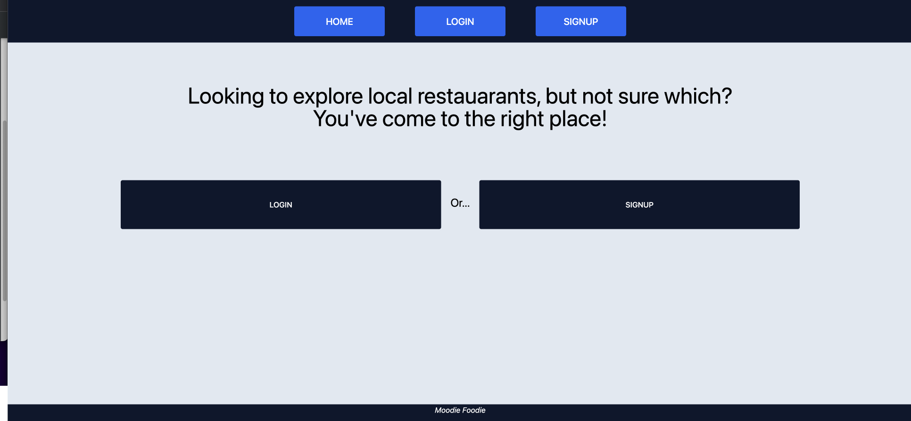
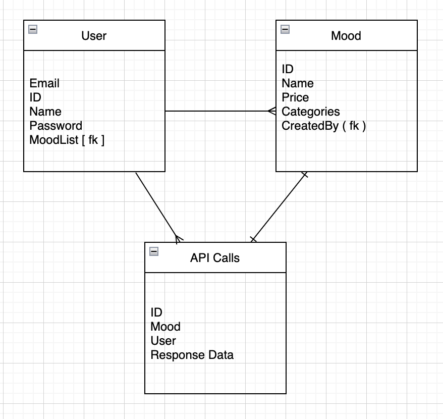

# Moodie Foodie...
### is an app that helps users pick what to eat. After signing up and logging in, users create custom moods that list food categories they ### ### like and how much they'd like to spend. Then, they input their location and pick which mood they'd like to use, and they're presented with ### a list of relevant restaurants. The user gives ratings to each restaurant and, at the end, the computer calculates the winner and presents it.

# Technologies Used
## React.js
## TypeScript
## Apollo GraphQL - Nexus, Prisma
## PostgreSQL
## Heroku

# Planning
    AAU - I don't know what I want to eat and I want some help finding restaurants I'd like.
    
    AAU - Part of me wants to pick what to eat, part of me just wants to look at a list of food pictures...

    AAU - I want to customize my moods so that I'm shown not just any food, but the food that I want to eat.

# Links
    https://moodiefoodie.herokuapp.com
    https://server-moodiefoodie.herokuapp.com
    https://github.com/BHenderson93/Capstone
    https://trello.com/b/SvDqwmCD/capstone

# Icebox
    Browser Requests location
    Save restaurants for later
    Type-safe all the code providing interfaces
    Change signup logic so that users do not need to logout and log back in on first attempt.